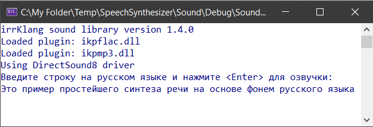

# The simpliest Speech Synthesizer

### Реализация простейшего синтезатора речи на основе фонем русского языка. 
Исполнено в виде консольного win32 приложения на C++. 
(Windows SDK 10.0, Platform Toolset v142, C++ 17 Standart)

Принцип работы:
1. Разбор введенной строки на фонемы;
2. Последовательное воспроизведение заранее записанных фонем.

* Является студенческим проектом в рамках изучения принципов ООП и методов защиты ПО.

### Пример работы:

Введенный текст: "Это пример простейшего синтеза речи на основе фонем русского языка"
--> [Озвучка](readme/first.m4a) <-- 

Введенный текст: "Хорошо произнесенные слова приносят удовлетворение. Хорошо проделанная работа имеет собственную награду"
--> [Озвучка](readme/second.m4a) <-- 